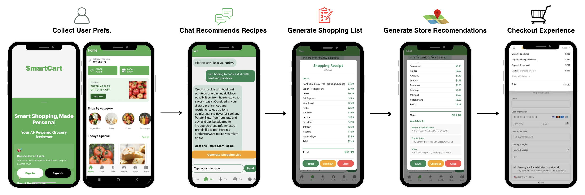

    
    
<strong>Use flow of SmartCart</strong> 
    (1) We collect user data including dietary restrictions, culinary preferences, and location; 
    (2) User chats with our agent to determine what dish they want to cook; 
    (3) Agent generates a shopping list and (4) store recommendations; 
    finally, (5) the user either navigates to the stores or uses our tailored checkout experience.

**SmartCart** is an AI-powered meal-planning assistant designed to simplify how home cooks organize their meals and grocery shopping. Whether you're a busy student, a working professional, or someone who simply wants an easier way to plan meals, SmartCart provides a seamless, all-in-one solution.

---

## Why SmartCart?  
Traditional meal planning often involves flipping through cookbooks, browsing social media, or searching the web for recipes. Finding the right ingredients at the best prices requires additional effort, from visiting multiple grocery stores to comparing prices manually. These time-consuming steps make home cooking less convenient, leading many to opt for takeout or pre-packaged meals.

SmartCart eliminates these inefficiencies by integrating **advanced AI technology** with **real-time grocery store data**, giving users a **smarter, faster, and more personalized** way to plan their meals.

---

## What SmartCart Offers  
✅ **Personalized Meal Planning** – Get meal recommendations tailored to your preferences, dietary needs, and culture.  
✅ **Smart Shopping Lists** – Automatically generate a detailed shopping list with estimated prices.  
✅ **Grocery Store Finder** – Locate nearby stores that have all the ingredients you need, ranked by price and distance.  
✅ **Alternative Store Suggestions** – If a store is out of stock, we suggest alternative locations to ensure you get everything on your list.  
✅ **Step-by-Step Cooking Instructions** – Follow clear, easy-to-understand instructions to prepare your meals.  

---

## How It Works  
1. **Choose Your Meal** – Get recipe recommendations based on your taste, diet, and available ingredients.  
2. **Generate a Shopping List** – SmartCart creates a list of all required ingredients with estimated prices.  
3. **Find the Best Grocery Store** – Using Google Maps API, the system identifies the most convenient and cost-effective store for your shopping.  
4. **Start Cooking!** – Follow step-by-step cooking instructions to bring your meal to life.  

---

## A Smarter Way to Cook  
SmartCart is more than just a meal planner—it's your **AI-powered kitchen companion**. By combining recipe discovery, grocery shopping assistance, and meal preparation in one app, SmartCart helps busy individuals **save time, reduce stress, and cook at home with ease**.

