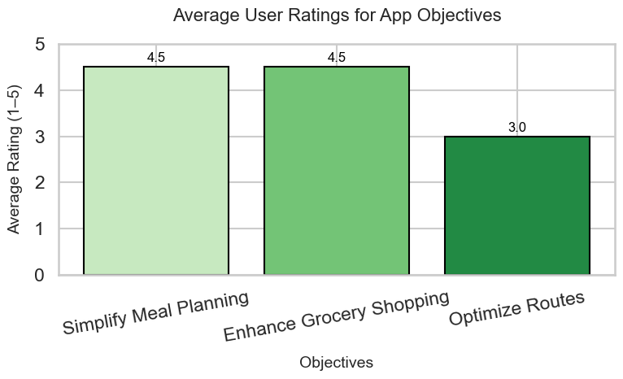

## Results

We evaluated SmartCart on three objectives by surveying our users on each one's performance.

1. **Simplify Meal Planning:** Did SmartCart make planning meals easier?
2. **Enhance Grocery Shopping:** Did SmartCart enhance or expedite your grocery shopping experience?
3. **Optimize Routes:** Did SmartCart make it easier to plan and execute your shopping trips?

Refer to **Figure** to see our current results. Figure presents the average survey responses evaluating SmartCart on three key objectives: simplifying meal planning, enhancing grocery shopping, and optimizing routes. The survey collected numerical ratings from users on a **1 to 5 scale**, with higher scores indicating better performance. The average response shows **roughly 4.5** in meal planning, **4.5** in enhanced grocery shopping, and **3.0** in route optimization.

We ran one extra survey to make sure that dietary restrictions were considered accurately in model outputs. Of the responses we received, **100% reported success**.

### Figure: Average Survey Results

## Conclusion

This project presents an innovative meal-planning LLM agent that significantly enhances the
user experience by streamlining meal selection, shopping list generation, and grocery store
recommendations. Through the integration of a React Native frontend, FastAPI backend
services, Firebase Firestore, and Google Maps API, the system provides a seamless, efficient,
and personalized meal-planning assistant for busy home cooks.
The evaluation results demonstrate that the system successfully simplifies meal planning
and grocery shopping, with a majority of users reporting improved efficiency in selecting
meals, generating shopping lists, and planning store visits. The ability to provide personalized meal recommendations and optimize grocery store selection was particularly wellreceived. However, some limitations were identified, including occasional mismatches in
product availability, challenges in rural areas due to limited store data, and a lack of real-time pricing information. Additionally, while the majority of users found meal suggestions
relevant, some desired greater flexibility in ingredient substitutions and increased transparency in recommendation logic.
To further enhance the system, future work should focus on integrating real-time pricing
APIs from grocery retailers to provide more accurate cost estimates and product availability
updates. Expanding the ingredient substitution feature would allow users to customize their
shopping lists more effectively based on personal preferences or dietary restrictions. Furthermore, improving store data coverage, particularly in rural and less densely populated
areas, would ensure that users across different regions receive high-quality recommendations. Additional refinements, such as the ability to prioritize organic or locally sourced ingredients and incorporating real-time stock tracking, could further improve the assistant’s
functionality and user satisfaction.
Overall, the results validate the system’s potential as a practical and intelligent solution for
meal planning and grocery shopping. By addressing the identified limitations and incorporating user-driven improvements, future iterations of the assistant could provide an even
more seamless and adaptable experience, catering to a broader range of users and shopping
needs.